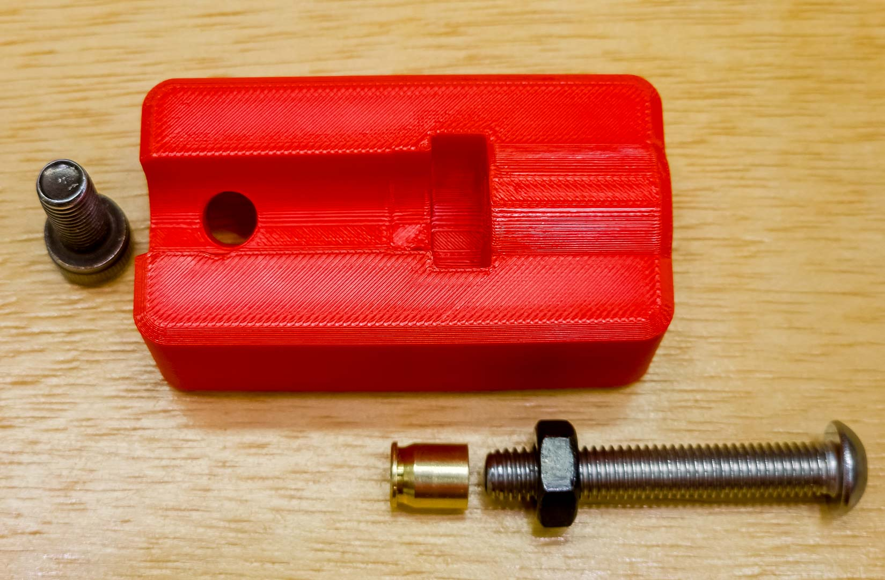
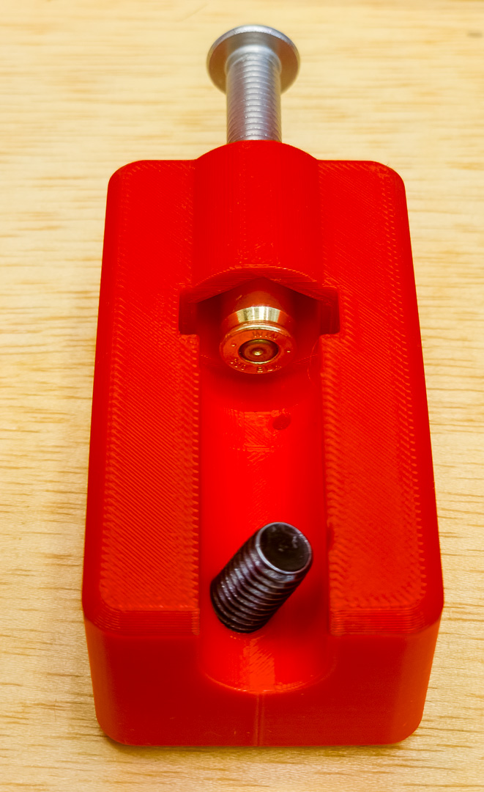
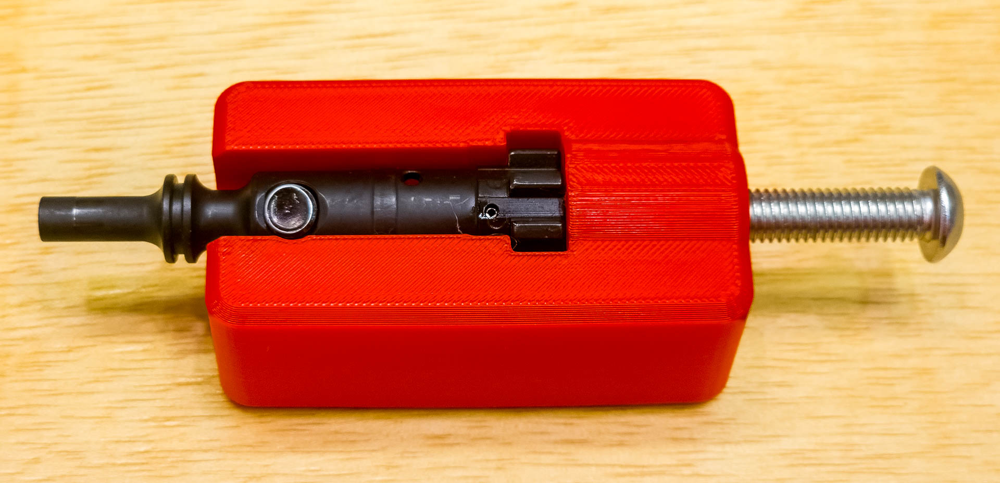

# AR15 Ejector-Removal Jig

## Introduction
This design is for an extremely simple and easy-to-print jig to compress the
ejector-spring in an AR-15 bolt so the roll-pin can be easily driven out
with a punch.

There are two versions ("left" and "right") that allow you to drive the pin out from
either side of the bolt.

## Printing:
Slicer setting do not seem to be be to critical. 

Thesee are probably a bit on the "light" side, but I used:
* Polymaker Polylight PLA
* 0.4mm nozzle.
* Two perimeters.
* Three botom layers and five top layers.
* The default Banbu slicer perimeter widths (~0.42mm) and layer height (0.2mm).
* 15% gyroid infill.

## Assembly
I requires a couple of pieces of hardware to complete:

1) A 20mm long M8 socket-head bolt to insert into the cam-pin hole. This prevents the bolt from turning when the pin is driven out.
2) An aT Least 25mm long M8 bolt to depress the ejector pin.
3) A 12mm long cut-off .223/5.56/300 BLK cartridge case.
4) An M8 nut.

I had to round over and polish the end of the M8 bolt that pushes on the 
cut-off cartridge so it would not catch on the cartridge interior.

I also smoothed and polished the end of the cam-pin bolt so it would fit into the cam-pin
hole.

The nut is pulled into the recess.





## Building the STL files from source:

In order to build these designs from the [OpenScad](https://openscad.org) source, you will need a few things:

1. [Python 3](https://www.python.org) (the version should not be critical - I am currently using 3.10.7)

1. Download an OpenSCAD build later than **OpenSCAD-2025.12.09** </br>
At the time of writing, the [OpenSCAD official release](https://openscad.org/downloads.html) is much too old, and you have to 
get one of the [nightly-builds](https://openscad.org/downloads.html#snapshots) (which have been very reiliable for years - I woud recommend the most recent one).

2. Note where the `openscad.exe` file in installed. </br>
I usually grab the `zip` installation and unzip it into a directory like `C:\tools\OpenSCAD-2025.12.09-x86-64` (when I'm using Windows).

2. Clone/unzip my OpenSCAD library beside this repository (i.e. in the same directtory)
[https://github.com/GeoffS/OpenSCAD_Lib](https://github.com/GeoffS/OpenSCAD_Lib)

2. Open a shell, and navigate to the directory where this repo is located.

1. Run the command: </br>
(the path after the `-osc` option is the one you noted above) </br>
`python ..\OpenSCAD_Lib\makeStls.py .\AR15_Ejector_Removal_Jig.scad -osc C:\tools\OpenSCAD-2025.12.09-x86-64\openscad.exe`

If all went well you should see these lines at the end of the output:
```
All commands completed with no errors.
Done!
```

You should also get three `.stl` files in the parent directory:
* AR15_Ejector_Removal_Jig LeftJig.stl
* AR15_Ejector_Removal_Jig RightJig.stl
* AR15_Ejector_Removal_Jig CartridgeInsert.stl

Ignore the last one; it's a work-in-progress to use an M6 bolt.

